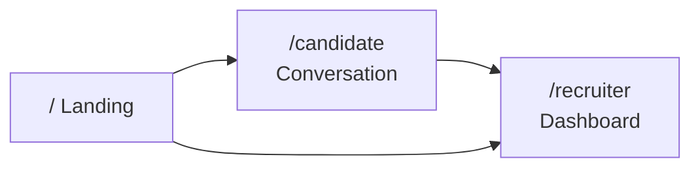
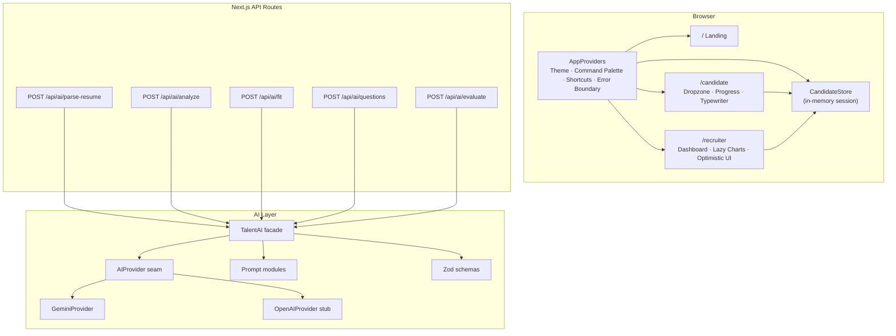
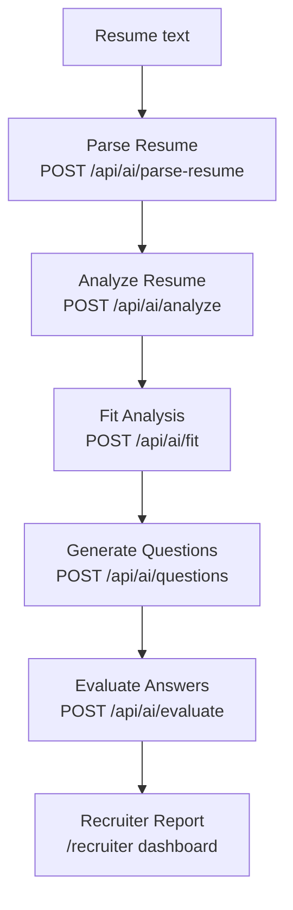
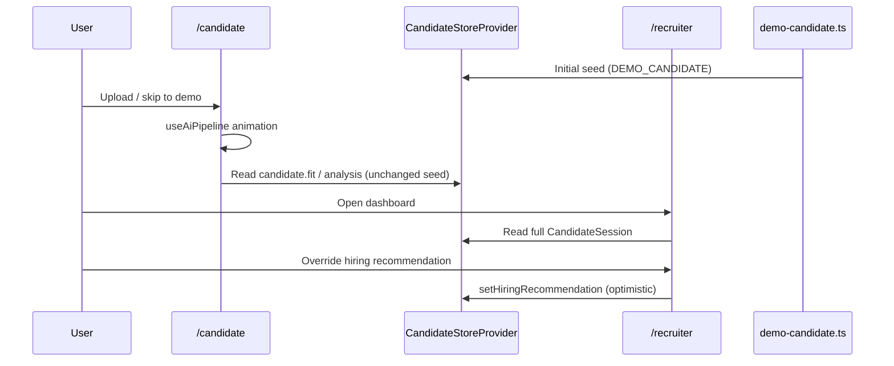
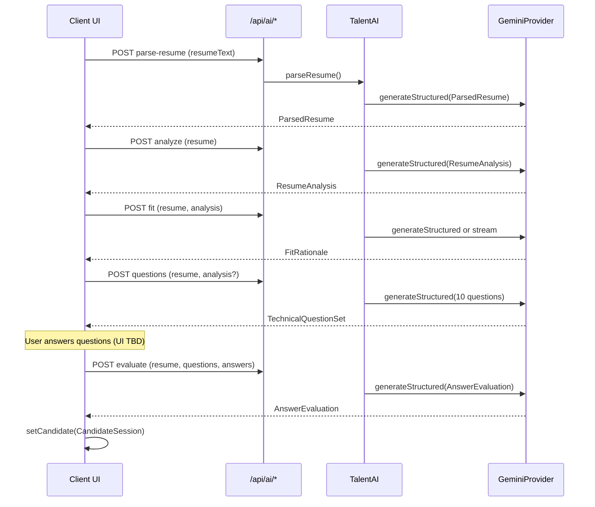

# Foundry

**AI Hiring Intelligence Platform**

<p align="center">
  
</p>

Premium, AI-native recruitment software — the kind of product a Series A team ships.

Parse resumes, generate adaptive interviews, evaluate answers, and present an executive hiring report. Demo state is **memory-only** (no auth, no database).

[](https://nextjs.org/)
[](https://react.dev/)
[](https://www.typescriptlang.org/)
[](https://ai.google.dev/)
[](https://zod.dev/)
[](https://vercel.com/)
[]()

---

## Table of contents

- [Overview](#overview)
- [Features](#features)
- [Repository highlights](#repository-highlights)
- [Project highlights](#project-highlights)
- [Product surfaces](#product-surfaces)
- [Architecture](#architecture)
- [Demo vs live AI](#demo-vs-live-ai)
- [Tech stack](#tech-stack)
- [Quick start](#quick-start)
- [Environment variables](#environment-variables)
- [Development workflow](#development-workflow)
- [Build & scripts](#build--scripts)
- [API reference](#api-reference)
- [AI pipeline & prompt engineering](#ai-pipeline--prompt-engineering)
- [State management & data flow](#state-management--data-flow)
- [Exports & keyboard shortcuts](#exports--keyboard-shortcuts)
- [Security & performance](#security--performance)
- [Accessibility & SEO](#accessibility--seo)
- [Deployment](#deployment)
- [Engineering decisions](#engineering-decisions)
- [Known limitations](#known-limitations)
- [Further reading](#further-reading)
- [Author](#author)
- [License](#license)

---

## Overview

**Foundry** is a portfolio-grade AI hiring intelligence platform that demonstrates an end-to-end hiring workflow:

1. **Candidate conversation** — upload a resume (or use the built-in demo), walk through a staged AI analysis animation, and receive a fit narrative.
2. **Recruiter dashboard** — executive hiring report with scores, radar chart, skill matrix, timeline, interview Q&A, and multi-format export.
3. **Server-side AI layer** — five REST endpoints backed by Google Gemini with Zod-validated structured outputs, retry logic, and a provider seam for future OpenAI support.

## Features

- AI resume parsing (structured `ParsedResume` via Gemini + Zod)
- Adaptive interview generation (10 role-calibrated technical questions)
- Structured AI evaluation (per-question scores + hiring recommendation)
- Executive recruiter dashboard (scores, radar, skill matrix, timeline, Q&A)
- ATS scoring and fit rationale
- Keyboard-first UX (command palette, navigation chords, theme toggle)
- PDF / Markdown / JSON / CSV exports (client-side)
- Provider abstraction (Gemini live · OpenAI seam stub)
- Streaming AI responses (`POST /api/ai/fit` with `stream: true`)
- Fully typed API contracts using Zod (request + response boundaries)

> The UI currently runs on seeded demo data with a staged analysis animation. The features above are implemented on the server-side AI layer — see [Demo vs live AI](#demo-vs-live-ai).

## Repository highlights

- Next.js App Router (15.5)
- React 19
- TypeScript (strict)
- Google Gemini (`@google/genai`)
- Zod 4 (API + AI output validation)
- Tailwind CSS v4
- Framer Motion
- Recharts
- Vercel deployment (`vercel.json` included)

## Project highlights

Verified counts from the current codebase:

- **5** production-ready AI API endpoints (`/api/ai/*`)
- **6** AI capabilities on `TalentAI` (parse, analyze, fit, stream fit, questions, evaluate)
- **10** adaptive interview questions per generation (`technicalQuestionSetSchema`)
- **4** export formats (PDF, Markdown, JSON, CSV)
- **7**-stage candidate workflow animation (`useAiPipeline`)
- **React 19** + **Next.js 15**

### Business problem

Technical hiring for AI-native product roles is slow, inconsistent, and hard to calibrate. Recruiters need structured signal (resume parsing, ATS scoring, tailored interview questions, answer evaluation) in one place — not scattered spreadsheets and ad-hoc notes.

### Target users

| Persona | Surface | Goal |
| --- | --- | --- |
| **Candidate** | `/candidate` | Understand fit for the target role through a conversational flow |
| **Recruiter / hiring manager** | `/recruiter` | Review an executive hiring report and override the recommendation |
| **Engineer / evaluator** | `/api/ai/*` | Integrate or test the AI capabilities directly |

The demo calibrates all AI outputs against a single target role defined in `src/constants/role.ts`: **AI Product Engineer (Mid–Senior)**.

---

## Product surfaces

| Route | Experience |
| --- | --- |
| `/` | Brand landing · keyboard-first navigation |
| `/candidate` | Conversational AI flow · staged thinking · typewriter |
| `/recruiter` | Executive hiring report · insights · export toast |



---

## Architecture

Full diagram and folder map: **[docs/ARCHITECTURE.md](./docs/ARCHITECTURE.md)**



### AI hiring pipeline

Core server-side flow (callable today via `/api/ai/*`; UI integration planned):



```text
Resume
   │
   ▼
Parse Resume
   │
   ▼
Analyze Resume
   │
   ▼
Fit Analysis
   │
   ▼
Generate Questions
   │
   ▼
Evaluate Answers
   │
   ▼
Recruiter Report
```

### Folder structure

```text
src/
  app/                 # App Router pages, API routes, OG/favicon, robots, sitemap
  components/
    ai/                # Pipeline progress UI
    command/           # Command palette
    dashboard/         # Recruiter panels (charts lazy-loaded)
    illustrations/     # Original SVG art
    motion/            # Typewriter, thinking, progress, fade
    providers/         # App shell providers
    ui/                # Button, Badge, Skeleton, ErrorBoundary
    upload/            # Drag & drop resume
  constants/           # TARGET_ROLE — single source of truth for hiring context
  data/                # DEMO_CANDIDATE seed (Aisha Rahman)
  hooks/               # Keyboard shortcuts, AI pipeline, optimistic UI, file drop
  lib/
    ai/                # Provider seam, prompts, services, HTTP helpers, schemas
    export/            # PDF / MD / JSON / CSV client-side export
    seo.ts / site.ts
  store/               # In-memory candidate session (React Context)
  types/               # Domain + dashboard types
docs/
  ARCHITECTURE.md      # System diagram, design principles, data flow
  DEPLOYMENT.md        # Vercel deploy guide
```

### Design principles

1. **Deep modules** — callers use `TalentAI` / `useCandidateStore`; providers and prompts stay internal.
2. **Memory-first demo** — no auth, no DB; session resets with the page or via command palette.
3. **Provider seam** — swap Gemini → OpenAI without touching UI or route handlers.
4. **Progressive enhancement** — charts and dashboard chunks lazy-load; skeletons fill the gap.
5. **Accessibility** — semantic landmarks, ARIA on interactive surfaces, reduced-motion support.

---

## Demo vs live AI

> **Important:** The browser UI does **not** call `/api/ai/*` today. Verified by repository inspection — no client-side `fetch` to AI routes exists in `src/`.

| Layer | Behavior |
| --- | --- |
| **UI (candidate + recruiter)** | Reads and writes an in-memory `CandidateSession` seeded by `src/data/demo-candidate.ts`. Upload accepts PDF/DOCX (client validation only); analysis runs as a **timed animation** via `useAiPipeline`, then displays the seeded demo data. |
| **API routes (`/api/ai/*`)** | Fully implemented server-side endpoints. Require `GEMINI_API_KEY`. Callable via `curl`, Postman, or a future UI integration. |

The recruiter dashboard and candidate demo UI work **without** an API key. Live AI routes return `503` with code `MISSING_API_KEY` when `GEMINI_API_KEY` is unset.

---

## Tech stack

| Layer | Technology |
| --- | --- |
| **Framework** | Next.js 15 App Router (Turbopack for dev/build) |
| **UI** | React 19, TypeScript, Tailwind CSS 4, Framer Motion, Recharts, Lucide |
| **Theming** | `next-themes` (dark / light) |
| **AI** | Google Gemini via `@google/genai`; Zod schemas for structured outputs |
| **Validation** | Zod (request bodies + AI response shapes) |
| **Deploy** | Vercel (`vercel.json` included) |

**Not present in this repository:** database (Prisma/Drizzle/SQL), authentication, background jobs, Docker, Terraform, CI/CD (GitHub Actions), or automated tests.

---

## Quick start

```bash
cp .env.example .env.local
# Set GEMINI_API_KEY=your_key  (optional for UI-only demo)
npm install
npm run dev
```

Open **[http://localhost:8600](http://localhost:8600)**.

> **Port note:** `package.json` binds the dev server to port **8600** (`next dev --turbopack -p 8600`). `.env.example` defaults `NEXT_PUBLIC_APP_URL` to `http://localhost:8600` for local OG/sitemap URLs.

### Verify the demo

1. Visit `/` — landing page and keyboard shortcuts.
2. Visit `/candidate` — drag-drop upload, optional LinkedIn, staged analysis animation.
3. Visit `/recruiter` — dashboard, charts, hiring recommendation override, exports.
4. Press `⌘K` / `Ctrl+K` — command palette.

---

## Environment variables

Copy `.env.example` → `.env.local` (or `.env.local.example` — identical content):

```bash
# Public site URL (Open Graph / absolute links)
NEXT_PUBLIC_APP_URL=http://localhost:8600
NEXT_PUBLIC_APP_NAME=Foundry

# AI Provider: gemini | openai
AI_PROVIDER=gemini
AI_MODEL=gemini-2.5-flash
AI_TEMPERATURE=0.2
AI_MAX_RETRIES=3
AI_RETRY_BASE_DELAY_MS=500
AI_REQUEST_TIMEOUT_MS=60000

# Gemini (required when AI_PROVIDER=gemini and calling /api/ai/*)
GEMINI_API_KEY=

# OpenAI (optional — provider seam stub only; not implemented)
OPENAI_API_KEY=
```

| Variable | Default | Required | Purpose |
| --- | --- | --- | --- |
| `GEMINI_API_KEY` | — | Yes for live AI routes | Google AI Studio API key |
| `AI_PROVIDER` | `gemini` | No | `gemini` or `openai` (stub) |
| `AI_MODEL` | `gemini-2.5-flash` | No | Gemini model id |
| `AI_TEMPERATURE` | `0.2` | No | Base temperature (overridden per capability in `TalentAI`) |
| `AI_MAX_RETRIES` | `3` | No | Exponential backoff retries for retryable errors |
| `AI_RETRY_BASE_DELAY_MS` | `500` | No | Base delay for retry backoff |
| `AI_REQUEST_TIMEOUT_MS` | `60000` | No | Documented timeout budget (**not yet wired** to `AbortController` in `GeminiProvider`) |
| `NEXT_PUBLIC_APP_URL` | `http://localhost:8600` (see `.env.example`) | Recommended | Canonical URL for SEO metadata |
| `NEXT_PUBLIC_APP_NAME` | `Foundry` | No | Display name in shell and metadata |

Get a Gemini key: [Google AI Studio](https://aistudio.google.com/apikey).

---

## Development workflow

```bash
npm run dev        # Turbopack dev server on port 8600
npm run build      # Production build (Turbopack)
npm run start      # Start production server (default port 3000)
npm run lint       # ESLint (next/core-web-vitals + typescript)
npm run typecheck  # tsc --noEmit
```

### Local production parity

```bash
cp .env.example .env.local
npm install
npm run build
npm run start
```

Path alias: `@/*` → `./src/*` (see `tsconfig.json`).

---

## Build & scripts

| Script | Command | Notes |
| --- | --- | --- |
| `dev` | `next dev --turbopack -p 8600` | Hot reload |
| `build` | `next build --turbopack` | Static + server bundles |
| `start` | `next start` | Production server |
| `lint` | `eslint` | Flat config via `eslint.config.mjs` |
| `typecheck` | `tsc --noEmit` | Strict mode enabled |

**Build optimizations** (`next.config.ts`):

- `optimizePackageImports` for `lucide-react`, `framer-motion`, `recharts`
- Compression enabled; `poweredByHeader` disabled
- AVIF/WebP image formats; security headers (nosniff, referrer-policy, permissions-policy)

**Vercel** (`vercel.json`): region `iad1`, security headers (`X-Frame-Options: DENY`, `X-Content-Type-Options: nosniff`).

---

## API reference

All routes use `runtime = "nodejs"`. Responses follow a consistent envelope from `src/lib/ai/http.ts`.

### Response envelope

**Success:**

```json
{ "ok": true, "data": { } }
```

**Error:**

```json
{
  "ok": false,
  "error": {
    "code": "VALIDATION_ERROR",
    "message": "Invalid request body.",
    "details": { }
  }
}
```

| HTTP status | `error.code` | When |
| --- | --- | --- |
| 400 | `VALIDATION_ERROR` | Zod request validation failed |
| 422 | `CONTENT_BLOCKED` | Gemini safety filter |
| 429 | `RATE_LIMITED` | Provider rate limit |
| 503 | `MISSING_API_KEY` | `GEMINI_API_KEY` not set |

### Endpoints

| Capability | Method | Path | `maxDuration` |
| --- | --- | --- | --- |
| Parse resume | `POST` | `/api/ai/parse-resume` | 60s |
| Analyze resume | `POST` | `/api/ai/analyze` | 60s |
| Fit rationale | `POST` | `/api/ai/fit` | 60s |
| Technical questions | `POST` | `/api/ai/questions` | 60s |
| Evaluate answers | `POST` | `/api/ai/evaluate` | 90s |

#### `POST /api/ai/parse-resume`

**Request** (validated by `parseResumeRequestSchema`):

```json
{
  "resumeText": "Aisha Rahman\nSenior Product Engineer\n...",
  "linkedInUrl": "https://linkedin.com/in/aisharahman"
}
```

`linkedInUrl` is optional (nullable). `resumeText` is required, min length 1. Resume text is truncated to 80,000 characters in the prompt.

**Returns:** `ParsedResume` — name, contact, skills, education, experience, projects, achievements, certifications, links, `rawTextExcerpt`.

#### `POST /api/ai/analyze`

**Request:**

```json
{
  "resume": { },
  "linkedInUrl": null
}
```

`resume` must match `parsedResumeSchema`. **Returns:** `ResumeAnalysis` — summary, strengths, weaknesses, missing skills, ATS score (0–100), hiring recommendation, rationale.

Hiring recommendations: `"Strong Hire" | "Hire" | "Interview" | "Reject"`.

#### `POST /api/ai/fit`

**Request:**

```json
{
  "resume": { },
  "analysis": { },
  "stream": false
}
```

- `stream: false` (default) → structured `FitRationale` JSON.
- `stream: true` → SSE stream (`text/event-stream`) with chunks `{ "text": "..." }`, terminated by `data: [DONE]`.

Per-question temperature in `TalentAI`: structured fit uses `0.4`; stream uses `0.5`.

#### `POST /api/ai/questions`

**Request:**

```json
{
  "resume": { },
  "analysis": null
}
```

`analysis` is optional. **Returns:** `TechnicalQuestionSet` — exactly **10** questions (`q1`–`q10`) with categories, difficulty, rationale, expected signals, plus `adaptationNotes`.

Question categories: `fundamentals`, `llm-systems`, `product-sense`, `debugging`, `architecture`, `behavioral-technical`.

#### `POST /api/ai/evaluate`

**Request:**

```json
{
  "resume": { },
  "questions": [ ],
  "answers": [
    { "questionId": "q1", "answer": "..." }
  ]
}
```

Minimum one question and one answer. **Returns:** `AnswerEvaluation` — overall score (0–100), per-question scores (0–10), strengths, weaknesses, hiring recommendation.

### Example: curl

```bash
curl -s -X POST http://localhost:8600/api/ai/parse-resume \
  -H "Content-Type: application/json" \
  -d '{"resumeText":"Jane Doe\nSoftware Engineer\nSkills: TypeScript, React"}' \
  | jq .
```

Requires `GEMINI_API_KEY` in `.env.local`.

---

## AI pipeline & prompt engineering

### TalentAI facade

All AI capabilities flow through `TalentAI` (`src/lib/ai/services/talent-ai.ts`). Callers never invoke Gemini directly.

```text
API route  →  getTalentAI()  →  TalentAI method
                                    ├── build*Messages()  (prompts/)
                                    ├── Zod schema        (schemas/)
                                    └── AIProvider        (gemini | openai stub)
```

Singleton access: `getTalentAI()`. Test reset: `resetTalentAI()` / `resetAIProviderCache()`.

### Provider seam

| Provider | Status | Implementation |
| --- | --- | --- |
| **Gemini** | Production | Structured JSON via `responseMimeType` + `responseJsonSchema`; text + SSE streaming |
| **OpenAI** | Stub | Throws `PROVIDER_UNAVAILABLE` — interface exists for future swap |

Gemini errors are mapped to typed `AIError` codes (`RATE_LIMITED`, `TIMEOUT`, `SCHEMA_VALIDATION`, `CONTENT_BLOCKED`, etc.) with exponential backoff retry (`withRetry`).

Structured outputs convert Zod → JSON Schema via `zodToGeminiJsonSchema` for Gemini compatibility.

### System prompt

`TALENT_AI_SYSTEM` (`src/lib/ai/prompts/system.ts`) defines the recruiter persona:

- Evidence-based, calibrated, specific, fair
- Never invent employers, degrees, URLs, or metrics
- Target role context injected from `TARGET_ROLE`

### Capability → temperature

| Method | Temperature | Output |
| --- | --- | --- |
| `parseResume` | 0.1 | `ParsedResume` |
| `analyzeResume` | 0.2 | `ResumeAnalysis` |
| `generateFitRationale` | 0.4 | `FitRationale` |
| `streamFitRationale` | 0.5 | Markdown stream |
| `generateTechnicalQuestions` | 0.35 | 10-question set |
| `evaluateAnswers` | 0.2 | `AnswerEvaluation` |

### UI pipeline animation

The candidate-facing "AI pipeline" (`useAiPipeline`) is a **client-side stage timer**, not a live AI call:

```text
Reading resume → Understanding projects → Extracting skills →
Reasoning about experience → Evaluating product mindset →
Generating interview → Preparing recruiter report
```

Respects `prefers-reduced-motion` (faster stage transitions when enabled).

---

## State management & data flow



### CandidateSession shape

Defined in `src/types/dashboard.ts`. Includes:

- Parsed resume, analysis, fit rationale, 10 questions + answers, evaluation
- Derived dashboard data: `scores`, `skillMatrix`, `radar`, `timeline`
- `updatedAt` ISO timestamp

Reset paths: **Export bar → Reset**, command palette **Reset demo candidate**, page reload.

---

## Exports & keyboard shortcuts

### Exports

Available on the recruiter dashboard **Export bar** and via **command palette**:

| Format | Mechanism |
| --- | --- |
| **PDF** | Hidden iframe + browser print dialog |
| **Markdown** | Client-generated report (`buildMarkdownReport`) |
| **JSON** | Full `CandidateSession` payload |
| **CSV** | Flattened key fields, skills, Q&A |

Implementation: `src/lib/export/candidate-export.ts`.

### Keyboard shortcuts

| Shortcut | Action |
| --- | --- |
| `⌘K` / `Ctrl+K` | Open command palette |
| `Esc` | Close command palette |
| `T` | Toggle dark / light theme |
| `G` then `H` | Go home |
| `G` then `D` | Go to recruiter dashboard |
| `G` then `U` | Go to candidate upload |

Chord timeout for `G` sequences: 700ms (`app-providers.tsx`).

---

## Security & performance

### Security

- **No authentication or authorization** — demo scope; do not deploy with sensitive data.
- API keys are server-side only (`GEMINI_API_KEY`, `OPENAI_API_KEY`); never exposed to the client.
- Security headers in `next.config.ts` and `vercel.json` (`X-Frame-Options: DENY`, nosniff, referrer-policy, permissions-policy).
- `robots.ts` disallows crawling of `/api/`.
- Resume uploads are validated client-side (PDF/DOCX, 8MB max) but **not sent to the server** in the current UI.

### Performance

- Lazy-loaded radar chart (`next/dynamic`, `ssr: false`) with skeleton fallback
- `React.memo` on recruiter dashboard
- Package import optimization for heavy libraries
- Turbopack for dev and production builds
- Image caching (30-day minimum TTL); AVIF/WebP formats

---

## Accessibility & SEO

### Accessibility

- Skip link to `#main-content`
- Semantic landmarks (`header`, `nav`, `main`)
- ARIA roles: conversation `role="log"`, dropzone `role="button"`, hiring recommendation `role="radiogroup"`
- Focus rings on interactive elements
- Live regions for upload status and export toasts
- Motion components respect `prefers-reduced-motion`
- Default theme: **light** (`defaultTheme="light"` in `theme-provider.tsx`); toggle via header **Light / Dark** button or `T`

### SEO

- Root metadata, Open Graph, Twitter card (`src/lib/seo.ts`)
- Dynamic OG image (`/opengraph-image`), favicon (`/icon.svg`), apple icon
- `sitemap.xml` and `robots.txt` generated from App Router
- Fonts: General Sans (headings), Inter (body), Geist Mono (code) via `next/font`

---

## Deployment

Zero-modification Vercel deploy — full guide: **[docs/DEPLOYMENT.md](./docs/DEPLOYMENT.md)**

```bash
npx vercel
# Set GEMINI_API_KEY in Vercel → Settings → Environment Variables
```

Framework preset: **Next.js** (auto-detected). Build: `npm run build`. Region default: `iad1`.

**Production notes:**

- No database migrations, auth setup, or Redis required.
- UI works without API key; `/api/ai/*` requires `GEMINI_API_KEY`.
- Set `NEXT_PUBLIC_APP_URL` to your production URL for correct OG metadata.

---

## Engineering decisions

| Decision | Rationale | Trade-off |
| --- | --- | --- |
| **In-memory session (React Context)** | Zero infra for portfolio demo; instant UX | No persistence, no multi-user |
| **TalentAI deep module** | Single entry for all AI; prompts/schemas hidden | Must extend facade for new capabilities |
| **Zod at API + AI boundaries** | Request validation + structured output enforcement | Schema drift requires coordinated updates |
| **Gemini JSON schema mode** | Reliable structured outputs vs free-form parsing | Provider-specific schema conversion |
| **OpenAI stub** | Proves seam without shipping second provider | `AI_PROVIDER=openai` fails at runtime |
| **Demo UI decoupled from API** | Showcase UX without API key; routes testable independently | Upload flow does not yet invoke live parsing |
| **Optimistic hiring recommendation** | Snappy recruiter UX (`useOptimistic`) | Changes exist only in memory |

---

## Known limitations

Verified gaps (not roadmap promises):

| Area | Finding |
| --- | --- |
| **UI ↔ API integration** | Candidate flow does not call `/api/ai/*`; uploaded files are not parsed server-side |
| **LinkedIn URL in UI** | Collected in `/candidate` conversation but **not written** to `CandidateStore` or sent to APIs |
| **OpenAI provider** | Stub only — all methods throw `PROVIDER_UNAVAILABLE` |
| **Persistence** | No database; session lost on refresh unless re-seeded |
| **Auth** | None |
| **Tests** | No test files (`*.test.*`, `*.spec.*`) in repository |
| **CI/CD** | No `.github/workflows` or equivalent |
| **Containerization** | No Dockerfile or docker-compose |
| **Port defaults** | Dev: **8600** (`npm run dev`); production `npm start`: **3000** unless `PORT` set; `getAppUrl()` falls back to `http://localhost:3000` when `NEXT_PUBLIC_APP_URL` is unset |
| **License file** | README states private demo; no `LICENSE` file present |

---

## Intended live AI flow (not wired to UI)

When the candidate UI is integrated with `/api/ai/*`, the server-side sequence is:



Today, the UI skips this path and reads `DEMO_CANDIDATE` from `CandidateStoreProvider`.

---

## Troubleshooting

| Symptom | Likely cause | Fix |
| --- | --- | --- |
| Dev server not on expected port | `npm run dev` binds **8600** | Open `http://localhost:8600` or change `-p` in `package.json` |
| `/api/ai/*` returns 503 | `GEMINI_API_KEY` missing | Set key in `.env.local`; restart dev server |
| `/api/ai/*` returns 400 | Invalid request body | Match schemas in `src/lib/ai/request-schemas.ts` |
| `/api/ai/*` returns 429 | Gemini rate limit | Retries run automatically; wait and retry |
| Upload does not change dashboard data | **By design today** | UI does not parse uploads or call APIs; use API via `curl` or wire integration |
| Theme stuck on dark | `next-themes` localStorage | Click **Light** in header or clear site data |
| Hydration flash on recruiter page | Client-only chart gate | Expected: `DashboardSkeleton` until `useMounted()` |
| OG URLs wrong locally | `NEXT_PUBLIC_APP_URL` defaults to 3000 | Set `NEXT_PUBLIC_APP_URL=http://localhost:8600` |

---

## Repository metadata

| Item | Value |
| --- | --- |
| **Package name** (`package.json`) | `foundry` |
| **Workspace folder** | `tamm` (local clone name may vary) |
| **Next.js version** | 15.5.21 |
| **React version** | 19.1.0 |

---

## Further reading

| Document | Contents |
| --- | --- |
| [docs/ARCHITECTURE.md](./docs/ARCHITECTURE.md) | Mermaid system diagram, folder map, design principles, demo + live data flow |
| [docs/DEPLOYMENT.md](./docs/DEPLOYMENT.md) | Vercel prerequisites, env vars, verification checklist, production notes |
| [CHANGELOG.md](./CHANGELOG.md) | Documentation change history |

---

## Author

**Habin Rahman**

Software Engineer focused on AI products, developer tools, and production-grade AI systems.

- GitHub: https://github.com/habinrahman
- LinkedIn: https://www.linkedin.com/in/habinrahman

---

## License

Private demo / portfolio project. No copyrighted third-party brand assets.
