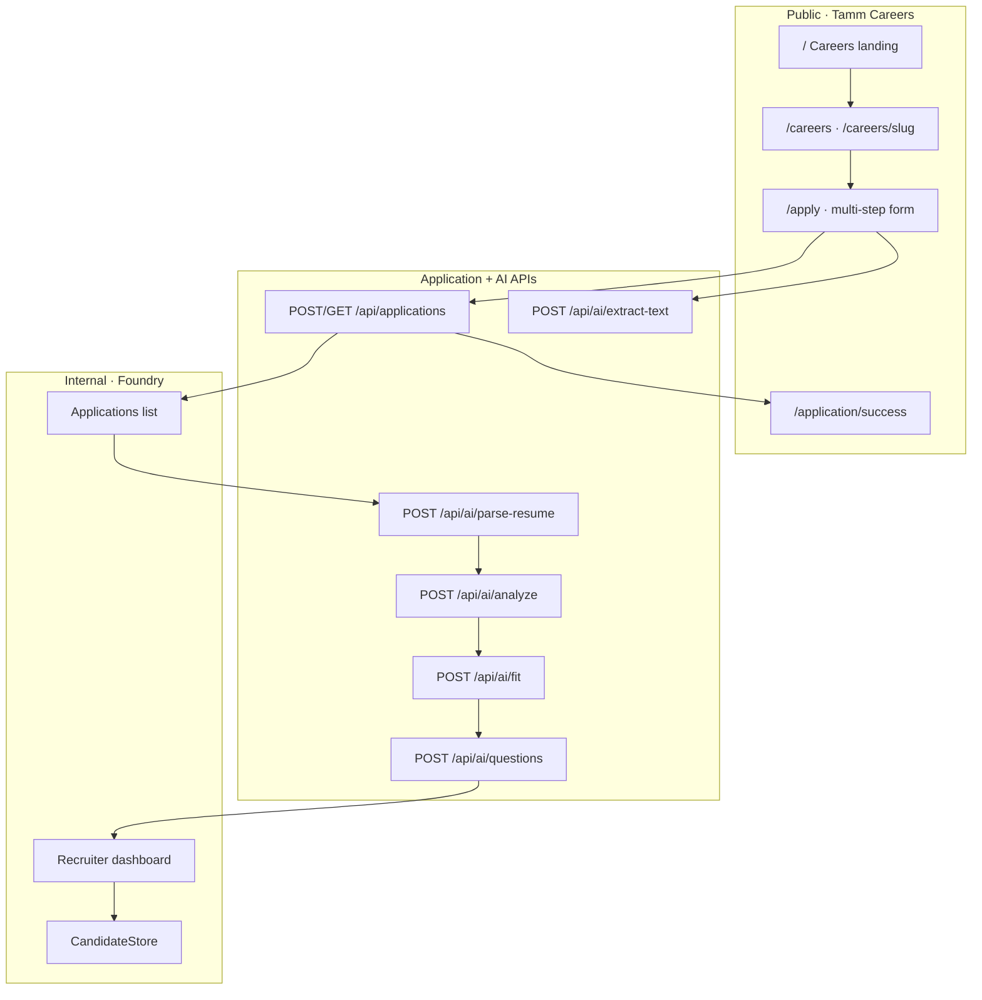
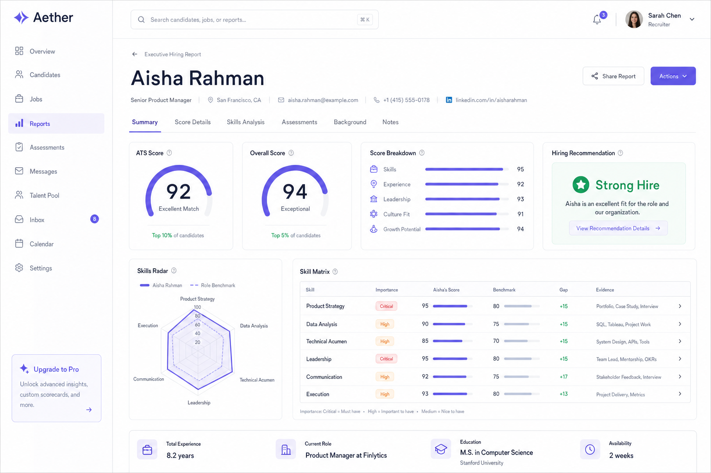
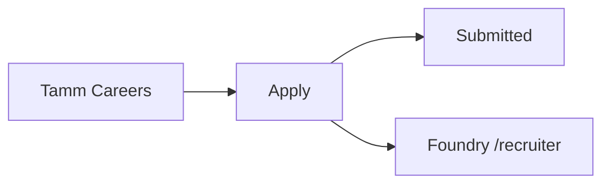
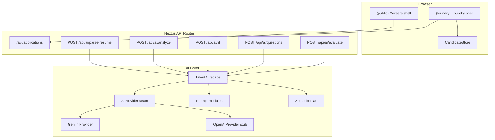
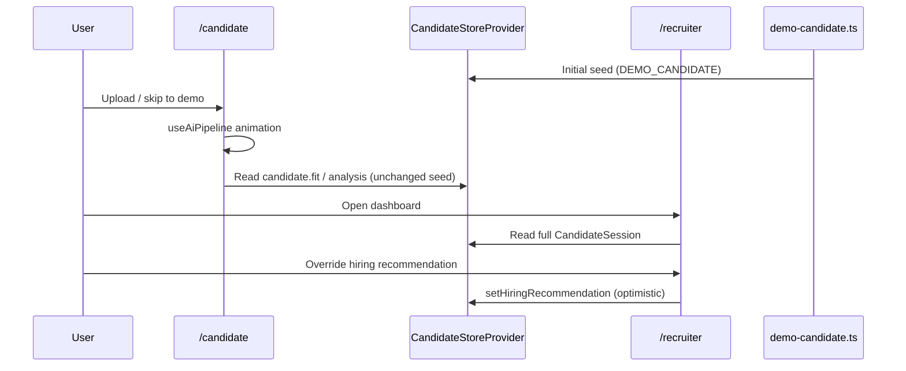
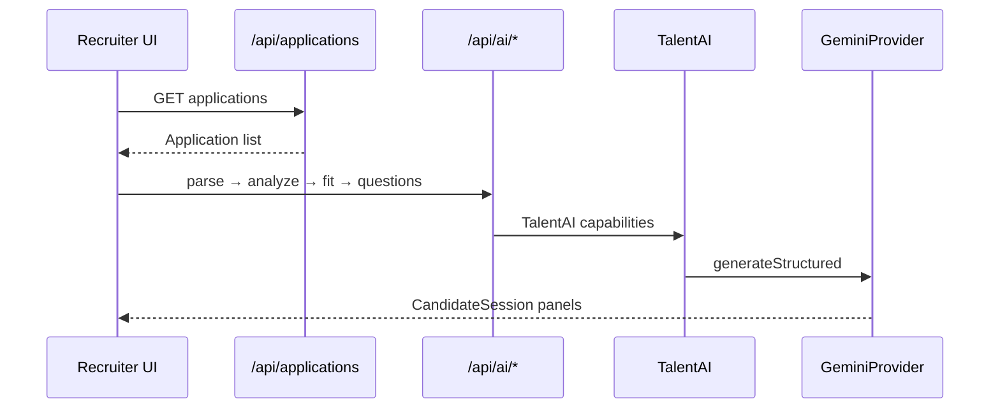

# Foundry — AI Hiring Intelligence Platform

End-to-end AI hiring workflow consisting of a **premium candidate application experience** and an **internal recruiter intelligence platform**.

Candidates apply through Tamm Careers. Recruiters review AI-generated insights in Foundry — resume parsing, skill extraction, ATS scoring, candidate summaries, interview questions, and hiring recommendations.

[](https://nextjs.org/)
[](https://react.dev/)
[](https://www.typescriptlang.org/)
[](https://ai.google.dev/)
[](https://zod.dev/)
[](https://vercel.com/)

---

## Table of contents

- [Why I built this](#why-i-built-this)
- [Overview](#overview)
- [Architecture](#architecture)
- [Candidate journey](#candidate-journey)
- [Recruiter journey](#recruiter-journey)
- [AI pipeline](#ai-pipeline)
- [Features](#features)
- [System design](#system-design)
- [Tech stack](#tech-stack)
- [Screenshots](#screenshots)
- [Quick start](#quick-start)
- [Environment variables](#environment-variables)
- [API reference](#api-reference)
- [Roadmap](#roadmap)
- [Author](#author)
- [License](#license)

---

## Why I built this

Many hiring processes still rely on generic forms that collect information but don't help recruiters make better decisions. Foundry explores a different approach: a premium candidate application experience paired with an AI-powered recruiter workspace that transforms resumes into structured, actionable hiring insights.

---

## Overview

**Foundry** is an AI Hiring Intelligence Platform. It is **not** a traditional ATS.

It demonstrates a complete hiring narrative:

1. **Public careers** — candidates discover roles and submit a premium multi-step application.
2. **Application intake** — validated submissions land in a repository-backed applications API.
3. **Recruiter intelligence** — Foundry opens the application, runs resume intelligence, and presents an executive hiring report.

| Audience | Surfaces | What they see |
| --- | --- | --- |
| Candidates | `/`, `/careers`, `/apply`, `/application/success` | Tamm Careers only — never Foundry chrome |
| Recruiters | `/recruiter` | Foundry applications inbox + AI hiring report |
| Internal demo | `/candidate` | Optional Talk flow for AI pipeline demos |

Demo persistence is **in-memory** (no auth, no database). Swapping to PostgreSQL/Supabase is designed as a repository replacement.

---

## Architecture

```text
                    Public Experience

              Tamm Careers Landing
                       │
                       ▼
                  Job Details
                       │
                       ▼
              Premium Application
                       │
                       ▼
            POST /api/applications
                       │
                       ▼
            Application Repository
                       │
                       ▼
                 Foundry Platform
                       │
           ┌───────────┼────────────┐
           ▼           ▼            ▼
       Resume AI    ATS Engine   Interview AI
           │           │            │
           └───────────┼────────────┘
                       ▼
              Recruiter Dashboard
```

Route groups keep experiences separate:

- `(public)` — Tamm Careers layout and branding
- `(foundry)` — Foundry shell, command palette, candidate store

Applications domain:

```text
ApplicationService
  → ApplicationRepository (interface)
      → MemoryApplicationRepository   // now
      → Supabase / Postgres           // later — no UI rewrite
```



Full folder map: **[docs/ARCHITECTURE.md](./docs/ARCHITECTURE.md)**

---

## Candidate journey

```text
Tamm Careers
   ↓
Browse roles
   ↓
Role details
   ↓
Premium application (personal → position → profile → resume → questions)
   ↓
Review & edit
   ↓
Application submitted
```

Candidates stop at success. They are informed that Foundry prepares hiring insights for recruiters — they never enter the recruiter product.

---

## Recruiter journey

```text
Foundry
   ↓
Applications inbox (rich cards · relative time · resume/AI badges · ATS)
   ↓
Select candidate
   ↓
AI processing animation
   ↓
Resume intelligence · skills · ATS · summary · strengths/risks
   ↓
Interview questions · hiring recommendation
```

---

## AI pipeline

When a recruiter opens an application with resume text:

```text
Parse resume
   ↓
Analyze profile
   ↓
Fit rationale
   ↓
Interview questions
   ↓
Hiring report panels
```

If resume text is unavailable, Foundry shows a clearly labeled demo analysis so the dashboard remains demoable.

---

## Features

- Premium Tamm Careers landing, listings, and role detail pages
- Multi-step application with resume upload, review, and success timeline
- `POST /api/applications` with Zod validation and nested application model
- Foundry applications inbox with operational metrics
- Live Gemini resume intelligence wired into the existing recruiter dashboard
- ATS scoring, skill matrix, radar, strengths/risks, interview Q&A, recommendation
- Theme-aware design system (light + dark)
- Keyboard-first Foundry UX (command palette, shortcuts)
- Client-side PDF / Markdown / JSON / CSV export

---

## System design

| Concern | Approach |
| --- | --- |
| Public vs internal | App Router route groups + separate layouts |
| Applications | Service + repository abstraction; memory singleton for demo |
| AI | `TalentAI` facade, provider seam, Zod schemas |
| Recruiter UI | Applications list hydrates existing dashboard panels |
| State | Local apply form state; Foundry `CandidateStore` for insights |

### Design principles

1. **Deep modules** — UI talks to services; storage and providers stay swappable.
2. **Memory-first demo** — no auth/DB required to tell the full story.
3. **Recruiter-focused AI** — AI assists hiring decisions; candidates do not take an AI interview.
4. **Progressive enhancement** — charts lazy-load; processing animation respects reduced motion.
5. **Accessibility** — landmarks, focusable apply steps, status regions, skip links.

---

## Tech stack

- Next.js 15 (App Router) · React 19 · TypeScript
- Tailwind CSS v4 · Framer Motion · Recharts
- Google Gemini (`@google/genai`) · Zod 4
- next-themes · Lucide

---

## Screenshots

<p align="center">
  
</p>

---

## Quick start

```bash
pnpm install   # or npm install
cp .env.example .env.local
# set GEMINI_API_KEY for live AI analysis
pnpm dev       # http://localhost:8600
```

| Route | Purpose |
| --- | --- |
| `/` | Tamm Careers landing |
| `/careers` | Open roles |
| `/apply` | Application flow |
| `/recruiter` | Foundry recruiter intelligence |
| `/candidate` | Optional internal AI Talk demo |

---

## Roadmap

Concise next steps — not claimed as shipped:

- PostgreSQL / Supabase persistence (swap `MemoryApplicationRepository`)
- Recruiter authentication and RBAC
- Application lifecycle (Applied → Interview → Offer)
- Email notifications
- Team collaboration
- Analytics and reporting

Out of scope for this demo: full ATS kanban, scheduling, multi-tenant SaaS, candidate AI interviews.

---

## Environment variables

See `.env.example`. Core keys: `GEMINI_API_KEY`, optional `NEXT_PUBLIC_APP_URL`, `NEXT_PUBLIC_APP_NAME`.

---

## API reference

### Applications

| Method | Path | Purpose |
| --- | --- | --- |
| `POST` | `/api/applications` | Create application |
| `GET` | `/api/applications` | List applications |
| `GET` | `/api/applications/[id]` | Fetch one application |

### AI

| Method | Path | Purpose |
| --- | --- | --- |
| `POST` | `/api/ai/extract-text` | PDF/DOCX → text |
| `POST` | `/api/ai/parse-resume` | Structured resume |
| `POST` | `/api/ai/analyze` | Skills, strengths, risks |
| `POST` | `/api/ai/fit` | Fit rationale (+ optional stream) |
| `POST` | `/api/ai/questions` | Interview questions |
| `POST` | `/api/ai/evaluate` | Answer evaluation |

Further detail remains in the sections below and in **[docs/ARCHITECTURE.md](./docs/ARCHITECTURE.md)** / **[docs/DEPLOYMENT.md](./docs/DEPLOYMENT.md)**.

---

## Repository highlights

- Next.js App Router (15.5)
- React 19
- TypeScript (strict)
- Google Gemini (`@google/genai`)
- Zod 4 (API + AI output validation)
- Tailwind CSS v4
- Framer Motion
- Recharts
- Vercel deployment (`vercel.json` included)

## Project highlights

- **Public + internal** product surfaces in one repo
- **6** seeded engineering roles on Tamm Careers
- **5** production AI API endpoints (`/api/ai/*`)
- **Applications API** with repository abstraction
- **4** export formats (PDF, Markdown, JSON, CSV)

### Target role calibration

AI outputs calibrate against `src/constants/role.ts` (AI Product Engineer) when generating fit and questions.

---

## Product surfaces (detail)

| Route | Experience |
| --- | --- |
| `/` | Tamm Careers landing |
| `/careers` | Engineering opportunities |
| `/careers/[slug]` | Role details |
| `/apply` | Premium multi-step application |
| `/application/success` | Application received + progress |
| `/recruiter` | Foundry inbox + hiring intelligence |
| `/candidate` | Optional Talk / AI demo |



---

## Architecture (detail)

Full diagram and folder map: **[docs/ARCHITECTURE.md](./docs/ARCHITECTURE.md)**



### Folder structure

```text
src/
  app/
    (public)/          # Tamm Careers pages
    (foundry)/         # Foundry candidate + recruiter
    api/applications/  # Application intake
    api/ai/            # AI endpoints
  components/
    careers/           # Public careers UI
    dashboard/         # Recruiter panels + applications list
    ...
  data/careers/        # Role catalog
  lib/applications/    # Service + repository
  lib/ai/              # Provider seam, prompts, schemas
```

### Design principles

1. **Deep modules** — callers use `TalentAI` / `ApplicationService` / `useCandidateStore`.
2. **Memory-first demo** — no auth, no DB; applications clear on server restart.
3. **Provider seam** — swap Gemini → OpenAI without touching UI or route handlers.
4. **Progressive enhancement** — charts and dashboard chunks lazy-load; skeletons fill the gap.
5. **Accessibility** — semantic landmarks, ARIA on interactive surfaces, reduced-motion support.

---

## Demo vs live AI

| Layer | Behavior |
| --- | --- |
| **Tamm Careers apply** | Uploads resume, attempts `/api/ai/extract-text`, then `POST /api/applications` (memory store). |
| **Foundry recruiter** | Lists applications; selecting one with resume text runs the live AI pipeline (`parse` → `analyze` → `fit` → `questions`) into `CandidateStore`. |
| **No resume text** | Clearly labeled demo analysis so the dashboard stays demoable. |
| **`/candidate` Talk** | Optional internal demo path for conversational AI UX. |
| **API keys** | Live analysis needs `GEMINI_API_KEY`. Without it, analysis falls back to demo insights with a notice. |

---

## Development workflow

Use `npm run typecheck` and `npm run build` before shipping UI changes. Dev server: **port 8600**.

### Verify the product story

1. Visit `/` — Tamm Careers landing.
2. Open a role → Apply → complete Review → Submit.
3. Visit `/recruiter` — application card appears → View candidate → AI stages → hiring report.
4. Press `⌘K` / `Ctrl+K` on Foundry routes — command palette.

---

## Environment variables (detail)

Copy `.env.example` → `.env.local`:

```bash
NEXT_PUBLIC_APP_URL=http://localhost:8600
NEXT_PUBLIC_APP_NAME=Foundry
AI_PROVIDER=gemini
AI_MODEL=gemini-2.5-flash
GEMINI_API_KEY=
```

| Variable | Default | Required | Purpose |
| --- | --- | --- | --- |
| `GEMINI_API_KEY` | — | Yes for live AI | Google AI Studio API key |
| `AI_PROVIDER` | `gemini` | No | `gemini` or `openai` (stub) |
| `AI_MODEL` | `gemini-2.5-flash` | No | Gemini model id |
| `NEXT_PUBLIC_APP_URL` | `http://localhost:8600` (see `.env.example`) | Recommended | Canonical URL for SEO metadata |
| `NEXT_PUBLIC_APP_NAME` | `Foundry` | No | Display name in shell and metadata |

Get a Gemini key: [Google AI Studio](https://aistudio.google.com/apikey).

---

## Build & scripts

| Script | Command | Notes |
| --- | --- | --- |
| `dev` | `next dev --turbopack -p 8600` | Hot reload |
| `build` | `next build --turbopack` | Static + server bundles |
| `start` | `next start` | Production server |
| `lint` | `eslint` | Flat config via `eslint.config.mjs` |
| `typecheck` | `tsc --noEmit` | Strict mode enabled |

**Build optimizations** (`next.config.ts`):

- `optimizePackageImports` for `lucide-react`, `framer-motion`, `recharts`
- Compression enabled; `poweredByHeader` disabled
- AVIF/WebP image formats; security headers (nosniff, referrer-policy, permissions-policy)

**Vercel** (`vercel.json`): region `iad1`, security headers (`X-Frame-Options: DENY`, `X-Content-Type-Options: nosniff`).

---

## API reference

All routes use `runtime = "nodejs"`. Responses follow a consistent envelope from `src/lib/ai/http.ts`.

### Response envelope

**Success:**

```json
{ "ok": true, "data": { } }
```

**Error:**

```json
{
  "ok": false,
  "error": {
    "code": "VALIDATION_ERROR",
    "message": "Invalid request body.",
    "details": { }
  }
}
```

| HTTP status | `error.code` | When |
| --- | --- | --- |
| 400 | `VALIDATION_ERROR` | Zod request validation failed |
| 422 | `CONTENT_BLOCKED` | Gemini safety filter |
| 429 | `RATE_LIMITED` | Provider rate limit |
| 503 | `MISSING_API_KEY` | `GEMINI_API_KEY` not set |

### Endpoints

| Capability | Method | Path | `maxDuration` |
| --- | --- | --- | --- |
| Parse resume | `POST` | `/api/ai/parse-resume` | 60s |
| Analyze resume | `POST` | `/api/ai/analyze` | 60s |
| Fit rationale | `POST` | `/api/ai/fit` | 60s |
| Technical questions | `POST` | `/api/ai/questions` | 60s |
| Evaluate answers | `POST` | `/api/ai/evaluate` | 90s |

#### `POST /api/ai/parse-resume`

**Request** (validated by `parseResumeRequestSchema`):

```json
{
  "resumeText": "Aisha Rahman\nSenior Product Engineer\n...",
  "linkedInUrl": "https://linkedin.com/in/aisharahman"
}
```

`linkedInUrl` is optional (nullable). `resumeText` is required, min length 1. Resume text is truncated to 80,000 characters in the prompt.

**Returns:** `ParsedResume` — name, contact, skills, education, experience, projects, achievements, certifications, links, `rawTextExcerpt`.

#### `POST /api/ai/analyze`

**Request:**

```json
{
  "resume": { },
  "linkedInUrl": null
}
```

`resume` must match `parsedResumeSchema`. **Returns:** `ResumeAnalysis` — summary, strengths, weaknesses, missing skills, ATS score (0–100), hiring recommendation, rationale.

Hiring recommendations: `"Strong Hire" | "Hire" | "Interview" | "Reject"`.

#### `POST /api/ai/fit`

**Request:**

```json
{
  "resume": { },
  "analysis": { },
  "stream": false
}
```

- `stream: false` (default) → structured `FitRationale` JSON.
- `stream: true` → SSE stream (`text/event-stream`) with chunks `{ "text": "..." }`, terminated by `data: [DONE]`.

Per-question temperature in `TalentAI`: structured fit uses `0.4`; stream uses `0.5`.

#### `POST /api/ai/questions`

**Request:**

```json
{
  "resume": { },
  "analysis": null
}
```

`analysis` is optional. **Returns:** `TechnicalQuestionSet` — exactly **10** questions (`q1`–`q10`) with categories, difficulty, rationale, expected signals, plus `adaptationNotes`.

Question categories: `fundamentals`, `llm-systems`, `product-sense`, `debugging`, `architecture`, `behavioral-technical`.

#### `POST /api/ai/evaluate`

**Request:**

```json
{
  "resume": { },
  "questions": [ ],
  "answers": [
    { "questionId": "q1", "answer": "..." }
  ]
}
```

Minimum one question and one answer. **Returns:** `AnswerEvaluation` — overall score (0–100), per-question scores (0–10), strengths, weaknesses, hiring recommendation.

### Example: curl

```bash
curl -s -X POST http://localhost:8600/api/ai/parse-resume \
  -H "Content-Type: application/json" \
  -d '{"resumeText":"Jane Doe\nSoftware Engineer\nSkills: TypeScript, React"}' \
  | jq .
```

Requires `GEMINI_API_KEY` in `.env.local`.

---

## AI pipeline & prompt engineering

### TalentAI facade

All AI capabilities flow through `TalentAI` (`src/lib/ai/services/talent-ai.ts`). Callers never invoke Gemini directly.

```text
API route  →  getTalentAI()  →  TalentAI method
                                    ├── build*Messages()  (prompts/)
                                    ├── Zod schema        (schemas/)
                                    └── AIProvider        (gemini | openai stub)
```

Singleton access: `getTalentAI()`. Test reset: `resetTalentAI()` / `resetAIProviderCache()`.

### Provider seam

| Provider | Status | Implementation |
| --- | --- | --- |
| **Gemini** | Production | Structured JSON via `responseMimeType` + `responseJsonSchema`; text + SSE streaming |
| **OpenAI** | Stub | Throws `PROVIDER_UNAVAILABLE` — interface exists for future swap |

Gemini errors are mapped to typed `AIError` codes (`RATE_LIMITED`, `TIMEOUT`, `SCHEMA_VALIDATION`, `CONTENT_BLOCKED`, etc.) with exponential backoff retry (`withRetry`).

Structured outputs convert Zod → JSON Schema via `zodToGeminiJsonSchema` for Gemini compatibility.

### System prompt

`TALENT_AI_SYSTEM` (`src/lib/ai/prompts/system.ts`) defines the recruiter persona:

- Evidence-based, calibrated, specific, fair
- Never invent employers, degrees, URLs, or metrics
- Target role context injected from `TARGET_ROLE`

### Capability → temperature

| Method | Temperature | Output |
| --- | --- | --- |
| `parseResume` | 0.1 | `ParsedResume` |
| `analyzeResume` | 0.2 | `ResumeAnalysis` |
| `generateFitRationale` | 0.4 | `FitRationale` |
| `streamFitRationale` | 0.5 | Markdown stream |
| `generateTechnicalQuestions` | 0.35 | 10-question set |
| `evaluateAnswers` | 0.2 | `AnswerEvaluation` |

### UI pipeline animation

The candidate-facing "AI pipeline" (`useAiPipeline`) is a **client-side stage timer**, not a live AI call:

```text
Reading resume → Understanding projects → Extracting skills →
Reasoning about experience → Evaluating product mindset →
Generating interview → Preparing recruiter report
```

Respects `prefers-reduced-motion` (faster stage transitions when enabled).

---

## State management & data flow



### CandidateSession shape

Defined in `src/types/dashboard.ts`. Includes:

- Parsed resume, analysis, fit rationale, 10 questions + answers, evaluation
- Derived dashboard data: `scores`, `skillMatrix`, `radar`, `timeline`
- `updatedAt` ISO timestamp

Reset paths: **Export bar → Reset**, command palette **Reset demo candidate**, page reload.

---

## Exports & keyboard shortcuts

### Exports

Available on the recruiter dashboard **Export bar** and via **command palette**:

| Format | Mechanism |
| --- | --- |
| **PDF** | Hidden iframe + browser print dialog |
| **Markdown** | Client-generated report (`buildMarkdownReport`) |
| **JSON** | Full `CandidateSession` payload |
| **CSV** | Flattened key fields, skills, Q&A |

Implementation: `src/lib/export/candidate-export.ts`.

### Keyboard shortcuts

| Shortcut | Action |
| --- | --- |
| `⌘K` / `Ctrl+K` | Open command palette |
| `Esc` | Close command palette |
| `T` | Toggle dark / light theme |
| `G` then `H` | Go home |
| `G` then `D` | Go to recruiter dashboard |
| `G` then `U` | Go to candidate upload |

Chord timeout for `G` sequences: 700ms (`app-providers.tsx`).

---

## Security & performance

### Security

- **No authentication or authorization** — demo scope; do not deploy with sensitive data.
- API keys are server-side only (`GEMINI_API_KEY`, `OPENAI_API_KEY`); never exposed to the client.
- Security headers in `next.config.ts` and `vercel.json` (`X-Frame-Options: DENY`, nosniff, referrer-policy, permissions-policy).
- `robots.ts` disallows crawling of `/api/`.
- Resume uploads are validated client-side (PDF/DOCX, 8MB max) but **not sent to the server** in the current UI.

### Performance

- Lazy-loaded radar chart (`next/dynamic`, `ssr: false`) with skeleton fallback
- `React.memo` on recruiter dashboard
- Package import optimization for heavy libraries
- Turbopack for dev and production builds
- Image caching (30-day minimum TTL); AVIF/WebP formats

---

## Accessibility & SEO

### Accessibility

- Skip link to `#main-content`
- Semantic landmarks (`header`, `nav`, `main`)
- ARIA roles: conversation `role="log"`, dropzone `role="button"`, hiring recommendation `role="radiogroup"`
- Focus rings on interactive elements
- Live regions for upload status and export toasts
- Motion components respect `prefers-reduced-motion`
- Default theme: **light** (`defaultTheme="light"` in `theme-provider.tsx`); toggle via header **Light / Dark** button or `T`

### SEO

- Root metadata, Open Graph, Twitter card (`src/lib/seo.ts`)
- Dynamic OG image (`/opengraph-image`), favicon (`/icon.svg`), apple icon
- `sitemap.xml` and `robots.txt` generated from App Router
- Fonts: General Sans (headings), Inter (body), Geist Mono (code) via `next/font`

---

## Deployment

Zero-modification Vercel deploy — full guide: **[docs/DEPLOYMENT.md](./docs/DEPLOYMENT.md)**

```bash
npx vercel
# Set GEMINI_API_KEY in Vercel → Settings → Environment Variables
```

Framework preset: **Next.js** (auto-detected). Build: `npm run build`. Region default: `iad1`.

**Production notes:**

- No database migrations, auth setup, or Redis required.
- UI works without API key; `/api/ai/*` requires `GEMINI_API_KEY`.
- Set `NEXT_PUBLIC_APP_URL` to your production URL for correct OG metadata.

---

## Engineering decisions

| Decision | Rationale | Trade-off |
| --- | --- | --- |
| **In-memory session (React Context)** | Zero infra for portfolio demo; instant UX | No persistence, no multi-user |
| **TalentAI deep module** | Single entry for all AI; prompts/schemas hidden | Must extend facade for new capabilities |
| **Zod at API + AI boundaries** | Request validation + structured output enforcement | Schema drift requires coordinated updates |
| **Gemini JSON schema mode** | Reliable structured outputs vs free-form parsing | Provider-specific schema conversion |
| **OpenAI stub** | Proves seam without shipping second provider | `AI_PROVIDER=openai` fails at runtime |
| **Demo UI decoupled from API** | Showcase UX without API key; routes testable independently | Upload flow does not yet invoke live parsing |
| **Optimistic hiring recommendation** | Snappy recruiter UX (`useOptimistic`) | Changes exist only in memory |

---

## Known limitations

| Area | Finding |
| --- | --- |
| **Persistence** | Applications live in a process memory store; cleared on server restart |
| **Auth** | None — demo-only |
| **OpenAI provider** | Stub only — throws `PROVIDER_UNAVAILABLE` |
| **Tests / CI** | No automated test suite or GitHub Actions workflows yet |
| **Full ATS** | No kanban, email, scheduling, or multi-tenant auth by design |

---

## Live AI flow (recruiter)



---

## Troubleshooting

| Symptom | Likely cause | Fix |
| --- | --- | --- |
| Dev server not on expected port | `npm run dev` binds **8600** | Open `http://localhost:8600` |
| Live analysis fails | `GEMINI_API_KEY` missing | Set key in `.env.local`; restart |
| Application missing after restart | Memory store reset | Re-submit via `/apply` |
| Theme stuck | `next-themes` localStorage | Toggle Light/Dark or clear site data |
| OG URLs wrong locally | `NEXT_PUBLIC_APP_URL` unset | Set `NEXT_PUBLIC_APP_URL=http://localhost:8600` |

---

## Repository metadata

| Item | Value |
| --- | --- |
| **Package name** (`package.json`) | `foundry` |
| **Workspace folder** | `tamm` (local clone name may vary) |
| **Next.js version** | 15.5.21 |
| **React version** | 19.1.0 |

---

## Further reading

| Document | Contents |
| --- | --- |
| [docs/ARCHITECTURE.md](./docs/ARCHITECTURE.md) | Mermaid system diagram, folder map, design principles, demo + live data flow |
| [docs/DEPLOYMENT.md](./docs/DEPLOYMENT.md) | Vercel prerequisites, env vars, verification checklist, production notes |
| [CHANGELOG.md](./CHANGELOG.md) | Documentation change history |

---

## Author

**Habin Rahman**

Software Engineer focused on AI products, developer tools, and production-grade AI systems.

- GitHub: https://github.com/habinrahman
- LinkedIn: https://www.linkedin.com/in/habinrahman

---

## License

Private demo / portfolio project. No copyrighted third-party brand assets.
